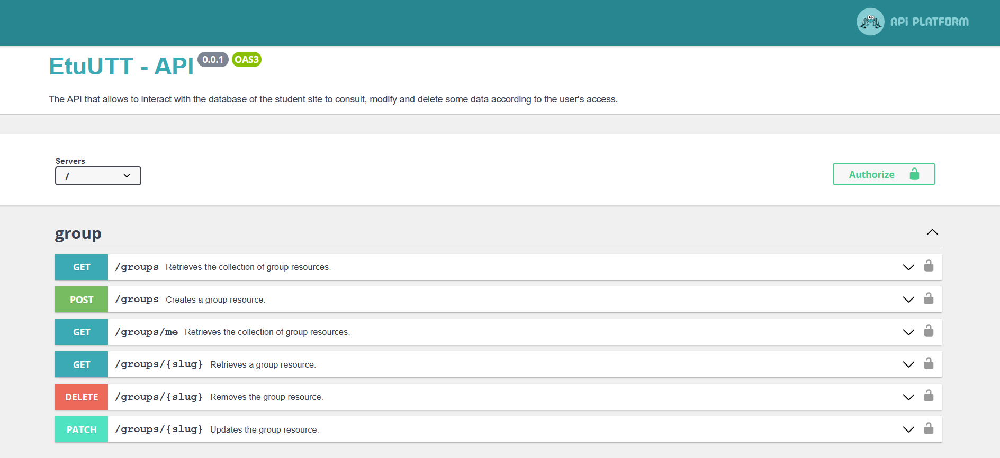
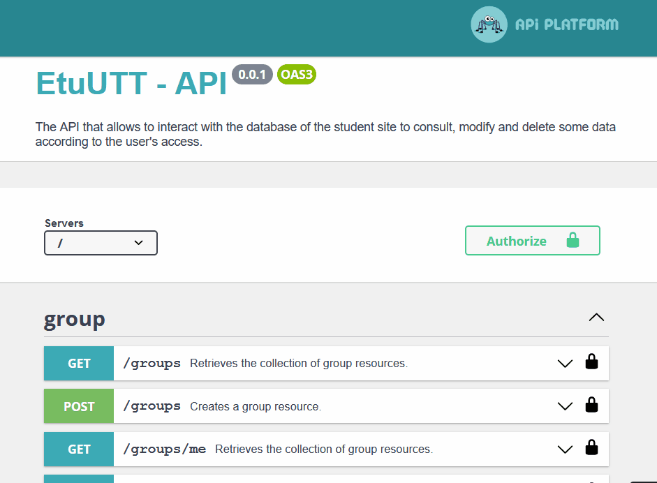
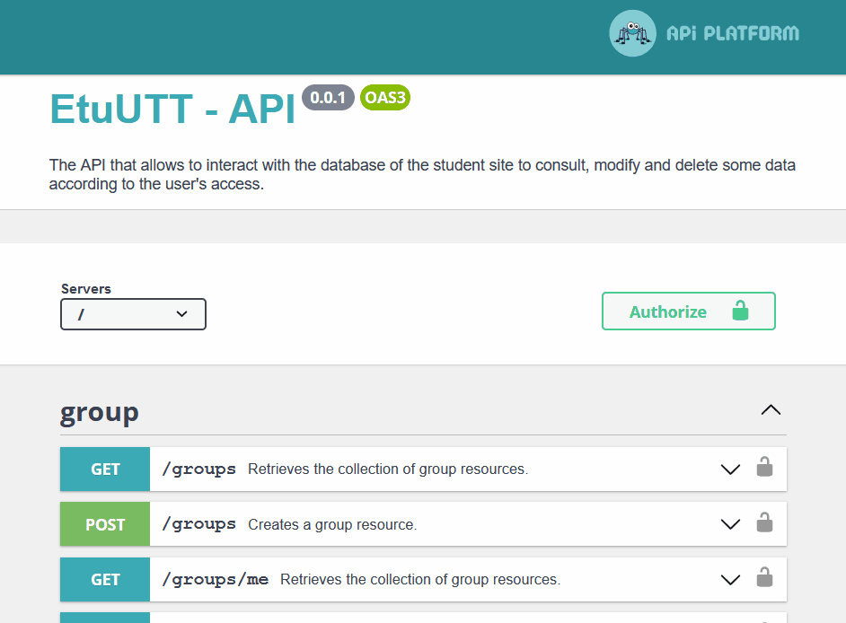

<div id="top"></div>


<!-- PROJECT SHIELDS -->
[](https://github.com/ungdev/etuutt-api/blob/master/LICENSE.txt)
[](http://commitizen.github.io/cz-cli/)


<!-- PROJECT LOGO -->
<br />
<div align="center">
  <a href="https://github.com/ungdev/etuutt-api">
    
  </a>

<h3 align="center">EtuUTT - API</h3>

  <p align="center">
    The API that allows to interact with the database of the student site to consult, modify and delete some data according to the user's access.
    <br />
    <a href="https://github.com/ungdev/etuutt-api"><strong>Explore the docs »</strong></a>
    <br />
    <br />
    <a href="https://api-etuutt-2020.dev.uttnetgroup.fr/">View Demo</a>
    ·
    <a href="https://github.com/ungdev/etuutt-api/issues">Report Bug</a>
    ·
    <a href="https://github.com/ungdev/etuutt-api/issues">Request Feature</a>
  </p>
</div>


<!-- TABLE OF CONTENTS -->
<details>
  <summary>Table of Contents</summary>
  <ol>
    <li>
      <a href="#about-the-project">About The Project</a>
      <ul>
        <li><a href="#built-with">Built With</a></li>
      </ul>
    </li>
    <li>
      <a href="#getting-started">Getting Started</a>
      <ul>
        <li><a href="#prerequisites">Prerequisites</a></li>
        <li><a href="#installation">Installation</a></li>
        <li><a href="#run-the-project">Run the project</a></li>
      </ul>
    </li>
    <li><a href="#folder-structure">Folder structure</a></li>
    <li>
      <a href="#usage">Usage</a>
      <ul>
        <li><a href="#make-a-request">Make a request</a></li>
        <li><a href="#log-a-user">Log a user</a></li>
        <li><a href="#useful-commands">Useful commands</a></li>
      </ul>
    </li>
    <li><a href="#contributing">Contributing</a></li>
    <li><a href="#license">License</a></li>
    <li><a href="#contact">Contact</a></li>
  </ol>
</details>


<!-- ABOUT THE PROJECT -->
## About The Project

[](https://api-etuutt-2020.dev.uttnetgroup.fr/)

Here's a screenshot of the Swagger UI. It is the user friendly way to deal with the API, so that front teams want to offer us beers ! 🍻\
It is also useful to test and debug new features.\
You can go to that page by clicking on the image.

<p align="right">(<a href="#top">back to top</a>)</p>


### Built With

* [Symfony](https://symfony.com/)
  
* [API Platform](https://api-platform.com/)
  

<p align="right">(<a href="#top">back to top</a>)</p>


<!-- GETTING STARTED -->
## Getting Started

This is the API documentation. Everything that concernes the front and the back is in [the project documentation](https://ungdev.github.io/etuutt-core/).\
First, you will have to read the project doc, then what follows.

### Prerequisites

At this point, thanks to [this part of the documentation](https://ungdev.github.io/etuutt-core/1-Configuration/), you have all prerequisites to install the API on your computer.

### Installation

1. Clone the repo by opening a command prompt in the folder you want it to be
   ```sh
   git clone https://github.com/ungdev/etuutt-api
   ```
2. Install composer packages
   ```sh
   composer install
   ```
3. Duplicate the `.env` file and name it `.env.local`\
   You will put your private info in this file, such as passwords or path to your local database. This `.env.local` will not be sent to GitHub, it is local to your computer.

### Run the project

Now that everything is installed and ready to go, let the magic begin ✨
```sh
symfony serve
```
Once the local server is running, go to [http://127.0.0.1:8000/](http://127.0.0.1:8000/)

<p align="right">(<a href="#top">back to top</a>)</p>


<!-- FOLDER STRUCTURE AND EXPLANATIONS -->
## Folder structure

```
./
├── .github/                # Files used to customize GitHub behavior
├── bin/                    # Executable files, called by CLI
|   ├── console             # The one we call to handle this Symfony project
|   └── phpunit             # The CLI to handle PHPUnit testing
├── config/                 # Configuration files for packages and services
├── docs/                   # Documentation files and images
├── migrations/             # DB migrations files, to version the DB without data loss
├── public/                 # All public files, includes the entry point
├── src/                    # The project's PHP source files
|   ├── ApiPlatform/        # Filters on data applied by API Platform
|   ├── Controller/         # Symfony controllers. It helps us to perform custom operations
|   ├── DataFixtures/       # Files that fill the DB with fake data to test
|   ├── DataProvider/       # Customized ways of retrieving data
|   ├── Doctrine/           # Doctrine custom tools (e.g. Listener)
|   ├── Entity/             # All Symfony entities
|   |   └── Traits/         # Properties and methods of entities factorized in PHP traits
|   ├── EventSubscriber/    # API Platform event listeners
|   ├── OpenApi/            # Swagger decorator for custom behavior
|   ├── Repository/         # Files to retrieve entities
|   ├── Security/           # Login process and Voters
|   └── Util/               # Static classes to centralize simple tasks
├── tests/                  # Automated tests (e.g. Unit tests)
├── var/                    # Generated files (cache, logs, etc)
├── vendor/                 # The third-party dependencies
├── .czrc                   # Git Commitizen configuration file
├── .dockerignore           # A Docker file to build image of the project
├── .env                    # Environment variables file. The content is accessible everywhere.
├── .env.local              # Environment variables specific to your computer, do not share it
├── .env.test               # Environment variables specific to the "test" environment
├── .gitignore              # The list of folders and files that will not be sent to GitHub
├── .php-cs-fixer.dist.php  # The set of rules and convention that PHP CS Fixer follows
├── .php-version            # Tells Symfony to use a specific version of PHP
├── .travis.yml             # Info and script for CI/CD
├── composer.json           # The list of dependencies and their versions
├── composer.lock           # The list of the dependencies's dependencies
├── docker-compose.yml      # A Docker file to build image of the project
├── Dockerfile              # A Docker file to build image of the project
├── LICENSE.txt             # MIT license text
├── phpunit.xml.dist        # The configuration file of the PHP testing framework, PHPUnit
├── README.md               # This amazing documentation
└── symfony.lock            # A proper lock file for Symfony recipes
```


<!-- USAGE EXAMPLES -->
## Usage

### Make a request

The Swagger UI allows us to see endpoint documentation as well as sending request to test them, awesome 😍\
Here is how to make a `GET` request via Swagger, but they all work the same.



In this example, we ask kindly to our API the list of all groups 😇\
As you can see, there is a pagination system, that is why above the `Execute` button, we can see an input to specify the page number.\
Dealing with other endpoints, you will have to fill a `request body` or more input parameters, to search for a specific entity for instance.\
\
The magical part comes when we hit this `Execute` button. Swagger sends the HTTP request to our API using `curl`, a command line tool to send request. To help us, it shows the command line it processed. There it is :
```sh
curl -X 'GET' \
  'http://127.0.0.1:8000/groups?page=1' \
  -H 'accept: application/ld+json' \
  -H 'CAS-LOGIN: admin'
```

Then, we wait for a short time, and the `response body` is prompted.\
The data we recieved comes with its metadata, this is the `ld+json` format.


### Log a user

In some cases, some requests have to be sent by a specific user. To authenticate a user, type its CAS login in the `Authorize` section as shown in the following gif.

But first, some points to keep in mind 📝
- There is a user which CAS login is `admin` that has all the privileges.
- Once the CAS login is filled in the authorize section, swagger will include a header containing this information in requests to the API.
- In production, this API is encapsulated in [the gateway](https://github.com/ungdev/etuutt-gateway), so that users have to give their credentials to authenticate. More about gateway authentication in [its documentation](https://github.com/ungdev/etuutt-gateway). Requests are sent to the gateway which forwards them to the API.



### Useful commands

Here is a list of commands to manipulate the database, entities and `php-cs-fixer`.

- To create the empty database.
   ```sh
   php bin/console doctrine:database:create
   ```
- To delete the database.
   ```sh
   php bin/console doctrine:database:drop --force
   ```
- To update the table structure to match all entities without migrations.
   ```sh
   php bin/console doctrine:schema:update --force
   ```
- To delete all tables in the database that are refereced by an entity.
   ```sh
   php bin/console doctrine:schema:drop --force
   ```
- To delete all tables in the database.
   ```sh
   php bin/console doctrine:schema:drop --full-database --force
   ```
- To start the database seeding based on `DataFixtures`.
   ```sh
   php bin/console doctrine:fixtures:load -n
   ```
- To regenerate the getters and setters of the targeted entity.
   ```sh
   php bin/console make:entity --regenerate
   ```
- To call `php-cs-fixer` to modify the PHP code on src folder so that it follows the conventions described in the `.php-cs-fixer.dist.php` file.
  
  Linux OS
   ```sh
   php vendor/bin/php-cs-fixer fix src
   ```
  Windows OS
   ```sh
   vendor/bin/php-cs-fixer.bat fix src
   ```

<p align="right">(<a href="#top">back to top</a>)</p>


<!-- CONTRIBUTING -->
## Contributing

If this project sounds interesting to you, and if you are motivated to learn a lot of things meaningful for your internship, you can send us a mail at [ung@utt.fr](mailto:ung@utt.fr) !

Or, if you just want to give us new ideas, you can simply [open an issue](https://github.com/ungdev/etuutt-api/issues/new) with the label `Feature request ✨`, or `Question 🙋‍♂️`\
Pssst... Don't forget to give the project a star 🤩

For those who are member of the team, there are the steps to add your changes to the `dev` branch.
1. You will be added to the team, with admin access to [the repo](https://github.com/ungdev/etuutt-api).
2. Create your Feature Branch (`git checkout -b feature/AmazingFeature`)
3. Write your code
4. Let PHP-cs_fixer do its job (`vendor/bin/php-cs-fixer.bat fix src` or `php vendor/bin/php-cs-fixer fix src`)
5. Commit your Changes using Commitizen (`cz`)
6. Push to the Branch (`git push origin feature/AmazingFeature`)
7. Open a Pull Request

<p align="right">(<a href="#top">back to top</a>)</p>


<!-- LICENSE -->
## License

Distributed under the MIT License. See `LICENSE.txt` for more information.

<p align="right">(<a href="#top">back to top</a>)</p>


<!-- CONTACT -->
## Contact

UTT Net Group - [ung@utt.fr](mailto:ung@utt.fr) - UTT, Troyes, France

Project Link : [https://github.com/ungdev/etuutt-api](https://github.com/ungdev/etuutt-api)

<p align="right">(<a href="#top">back to top</a>)</p>
